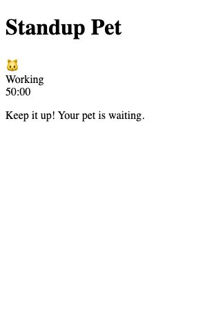
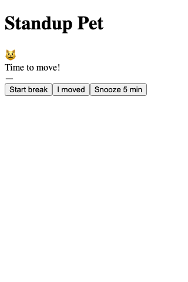
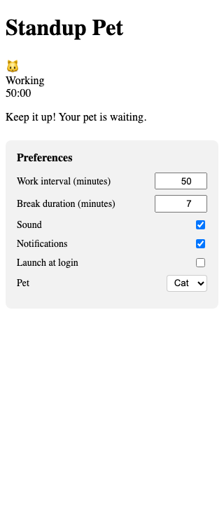

# Standup Pet

A pixel-art companion that lives in your **macOS menu bar** and nudges you to stand up and move. Click the tray icon to open the popover.

## Screenshots

| Working | Break due | Preferences |
|:---:|:---:|:---:|
|  |  |  |

## Overview

Standup Pet is a gentle, charming reminder to take movement breaks throughout the day. A pixel companion lives in your menu bar, quietly working alongside you — and starts nudging when it's time to get up.

- Configurable work intervals (default 50 min) and break durations (default 7 min)
- "I moved" acknowledges your break and resets the cycle
- Snooze option (up to 15 min total)
- Pick from 8 pixel companions (cat, dog, frog, turtle, pig, duck, wolf, bear) — real 16×16 pixel art, not emoji
- Menu bar icon shows your current pet and updates when mood changes
- Raycast Focus–style floating reminder bar when it's time to move
- Optional passive system notifications that won't steal focus
- Settings persist across restarts

## Stack

- **Tauri v2** (Rust shell — thin native layer)
- **React 19 + TypeScript** (frontend)
- **Vite** (build tool)
- **Vitest + React Testing Library** (tests)

The core logic (phase state machine, scheduling math) lives in pure TypeScript modules with no native dependencies so they're fully unit-testable headlessly.

## Development

```bash
# Install dependencies
npm install

# Start dev server (frontend only)
npm run dev

# macOS menu bar app (frontend + native tray popover)
npm run tauri dev
```

Regenerate menu bar PNGs after editing sprites:

```bash
npm run generate:tray-icons
```

On macOS this runs as a **menu bar utility** (no Dock icon): look for the tray icon near the clock, click it to open the popover. Right-click the icon for **Quit**.

## Automated verify

```bash
npm run verify
```

This runs:
1. `tsc --noEmit` — TypeScript typecheck
2. `eslint . --max-warnings 0` — Lint
3. `vitest run` — 99 unit + component tests
4. `vite build` — Frontend production build

All four must exit 0.

## Native build (manual step)

```bash
# Install Rust + Cargo if not present
curl --proto '=https' --tlsv1.2 -sSf https://sh.rustup.rs | sh

# Install Tauri CLI
cargo install tauri-cli --version "^2"

# Build the macOS app
npm run tauri build
```

The output `.app` and `.dmg` are in `src-tauri/target/release/bundle/`.

## Architecture

```
src/
├── lib/
│   ├── timerMachine.ts   # Phase state machine (pure TS)
│   ├── settings.ts       # Settings serialize/deserialize (pure TS)
│   ├── spriteState.ts    # Phase → animation key mapping (pure TS)
│   └── store.ts          # React context store + persistence
├── components/
│   ├── Pet.tsx           # Sprite renderer
│   ├── PixelSprite.tsx   # Pixel-framed companion glyph
│   ├── PetPicker.tsx     # Grid pet selector (Pixel Pets style)
│   ├── ReminderBar.tsx   # Raycast Focus–style floating nudge bar
│   ├── Timer.tsx         # Phase label + countdown
│   ├── Controls.tsx      # Phase hints + back-to-work
│   └── Preferences.tsx   # Settings UI
└── __tests__/
    ├── timerMachine.test.ts    # State machine tests (fake timers)
    ├── settings.test.ts        # Serialize/deserialize tests
    ├── spriteState.test.ts     # Sprite mapping tests
    └── components.test.tsx     # React component tests (RTL)
```

### Phase state machine

```
working ──(interval elapsed)──► break-due
working ◄──(I moved)────────── break-due
working ◄──(snooze)─────────── break-due (extends interval, returns to working)
break-due ──(start break)────► breaking
breaking ──(break elapsed)───► working
breaking ──(I moved)─────────► working
```

## Manual native checklist

After `npm run tauri build`:

- [x] App launches as a menu-bar item; popover opens on click
- [ ] Pet animates; idle/nudge/happy states are visually distinct
- [ ] Notification fires at break-due without stealing focus
- [ ] Launch-at-login persists across a real reboot
- [ ] Settings persist across quit and relaunch
- [ ] Packaged build runs on a clean macOS user account

## Roadmap

- Real activity detection (HealthKit integration)
- More pets and animation states
- Gamification (streaks, unlockables)
- Windows/Linux tray support (Tauri makes this feasible)
